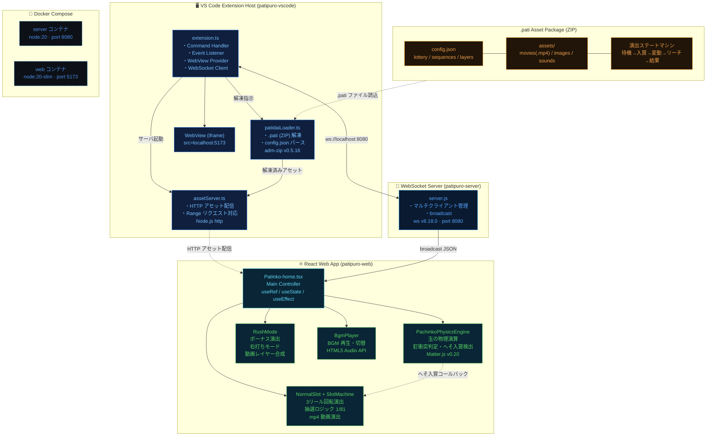
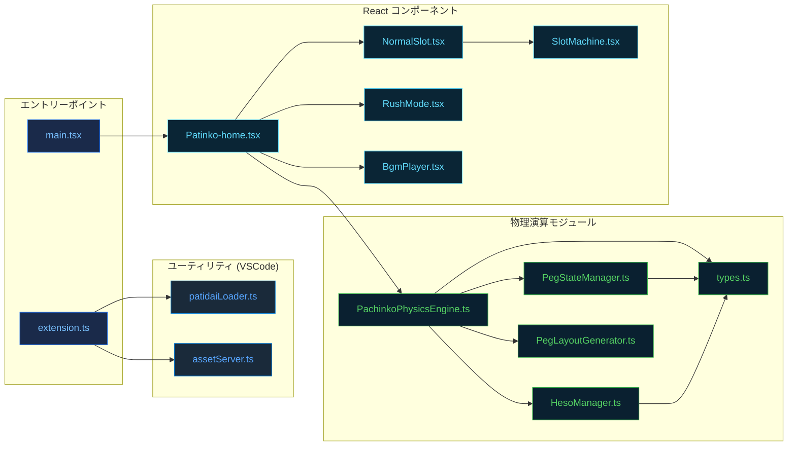
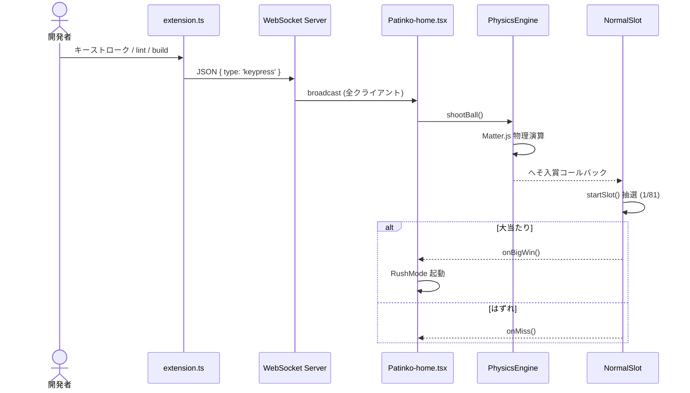

# PatiPro — Tech Architecture Diagram

> VS Code拡張 × パチンコ物理演算エンジン × WebSocketリレー

## システム全体構成図

## モジュール依存関係

## データフロー

## Tech Stack 一覧

| カテゴリ | 技術 | バージョン | 役割 |
|---|---|---|---|
| **Frontend** | React | 19.2.0 | UI / コンポーネント |
| **Frontend** | TypeScript | 5.9.3 | 型安全 |
| **Frontend** | Vite | 7.3.1 | ビルドツール / HMR |
| **Physics** | Matter.js | 0.20.0 | 物理演算エンジン |
| **WebSocket** | ws | 8.18.0 | リアルタイム通信 |
| **VS Code** | VS Code API | 1.93+ | 拡張機能 API |
| **VS Code** | TypeScript | 5.3.0 | 拡張機能型安全 |
| **Asset** | adm-zip | 0.5.16 | .pati ZIP 解凍 |
| **Runtime** | Node.js | 20 | サーバー実行環境 |
| **Infra** | Docker Compose | — | コンテナ管理 |
| **State** | React Hooks | — | UI / Game State |
| **DB** | — | — | DB なし（メモリのみ） |

---

> 自動生成: Claude Code · tech-architecture-diagram · 2026-02-26
